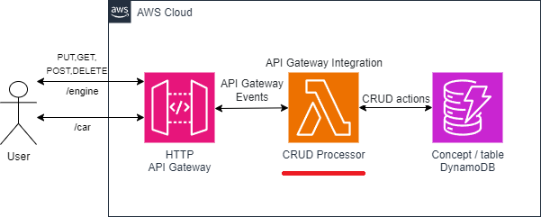
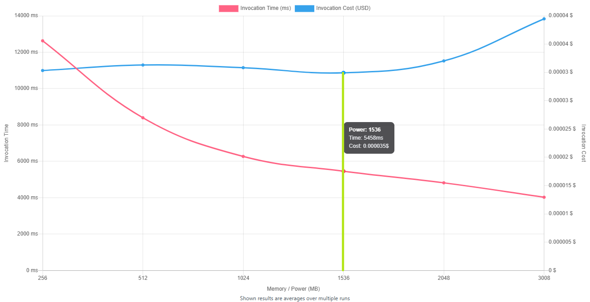

# API Gateway CRUD Processor

## 1. Overview

CRUD is the acronim of Create Read Update Delete and refers to the actions that can be done on the data that describe one Concept. 
This processor can handle multiple concepts, one concept is mapped for each API Gateway Route.
This Lambda take part from an application according to the below architecture where it is highlighted with red: API Gateway Integration / CRUD Processor.




## 2. Application functionality

The CRUD Processor could be invoked from Postman with simple URLs or with URL and JSON body, like below.

| API Gateway route										| Link 							|
| -------- 												| ------- 									|
|POST /engine	 					| https://<api_id>.amazonaws.com/engine?pk=engine&sk=dt&table=Engines								|
|GET  /engine	 					| https://<api_id>.amazonaws.com/engine?pk=engine&sk=dt&table=Engines&engine=M5-12346								|
|GET  /engine	 					| https://<api_id>.amazonaws.com/engine?pk=engine&sk=dt&table=Engines&engine=M5-12346&dt=2024-10-11 12:24:25								|
|POST /car	 						| https://<api_id>.amazonaws.com/car?pk=car&sk=dt&table=Car								|
|GET  /car	 						| https://<api_id>.amazonaws.com/car?pk=car&sk=dt&table=Car&car=B-15-SGP								|
|GET  /car	 						| https://<api_id>.amazonaws.com/car?pk=car&sk=dt&table=Car&car=B-15-SGP&dt=2024-10-11 12:24:25								|

<br>Below are some examples of JSON messages
```json
{
    "engine":"M5-12346",
    "dt":"2024-10-11 12:24:25",
    "temp":102,
    "temp_unit":"C",
    "speed":"150",
    "speed_unit":"rpm",
    "cmnt":"loud noise"
}

{
    "car":"B-15-SGP",
    "dt":"2024-10-11 12:24:25",
    "lat":45.5646,
    "lon":26.5646,
    "speed":120,
    "speed_unit":"km/h",
    "location":"str. Nicolae Lascar no.6",
    "cmnt":"high speed"
}
```
## 3. AWS SDK features used
- The log is done in all application using Log4j2, that sends output to AWS CloudWatch service
- Each AWS client used is encapsulated in a POJO application service
- Use DynamoDb Basic/JSON Client to communicate with DynamoDB
- Same Lambda is used as integration for multiple API Gateway routes  
- Deploy of AWS Lambda Function is done from the build process configured in pom.xml 
- Intercept Lambda events using Lambda internal extension mechanism (using built-in java Instrumentation) deployed in Lambda Layer (see api-gateway.event.get.json)
- Use Mockito & MockitoHamcrest test frameworks to mock AWS DynamoDB client; Thus, all the layers (handler,service,model) of the application, in their original form, are tested
- Use AspectJ and AWS Powertools-logging to trace the execution of methods in local and cloud environments


## 4. Tunning Lambda for smaller costs

Regarding costs, there is a balance among the runtime of the lambda and the memory it uses so that to obtain the best cost, because both influence the cost; when lambda uses low memory has longer execution time, while it uses more memory has smaller execution time. To find the right balance, see [here](https://github.com/alexcasalboni/aws-lambda-power-tuning) an application about this.
<br>The graph can be used to also see the dependency among costs and memory, when high execution speed is required.
<br>The parameters that I used for the Tunning Step Function are below:
```json
{
    "lambdaARN": "arn:aws:lambda:us-east-2:<account_id>:function:CRUDProcessor",
    "powerValues": [256, 512, 1024, 1536, 2048, 3008],
    "num": 50,
    "payloadS3": "s3://lambda-power-tuning/api-gateway.event.get.json",
    "parallelInvocation": true,
    "strategy": "cost"
}
```
The result of the lambda tunning is shown below, where the minimum price is obtained when lambda is configured to run with 1536 MB.

